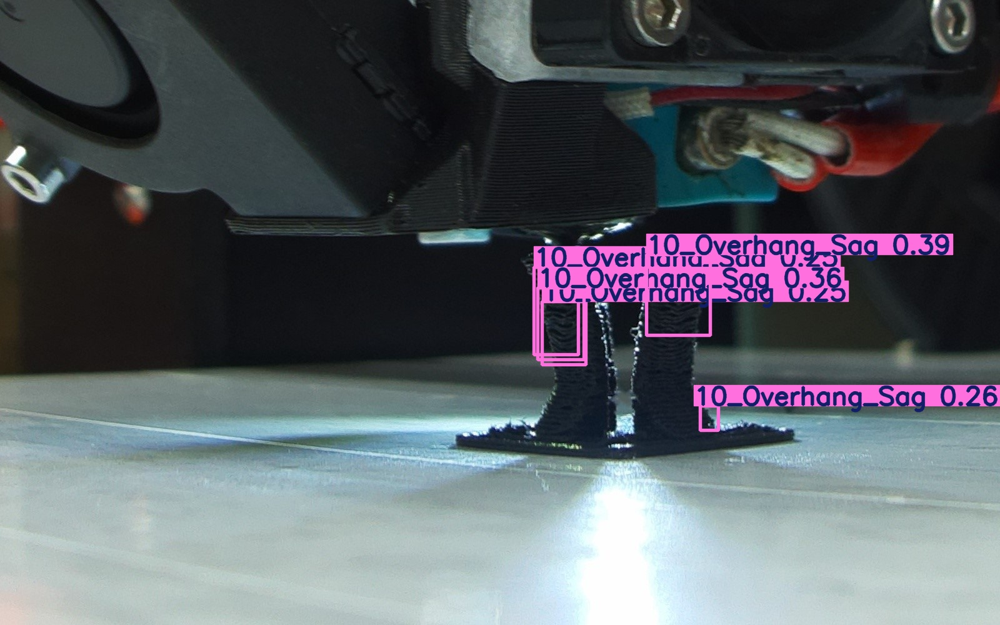
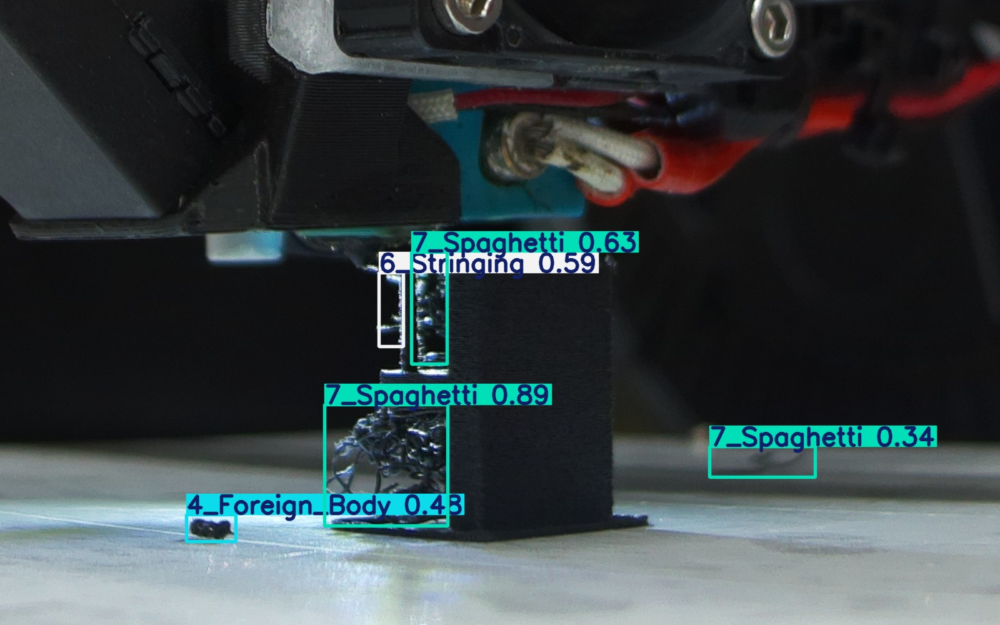
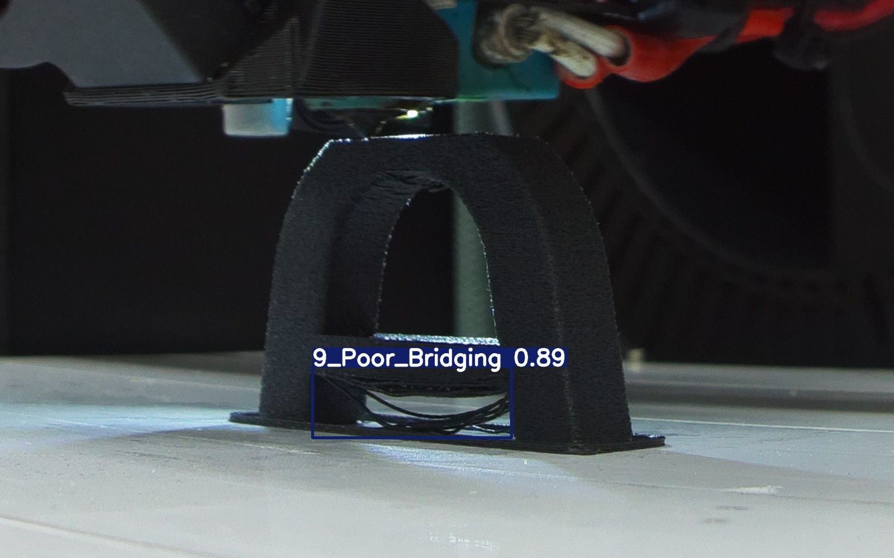
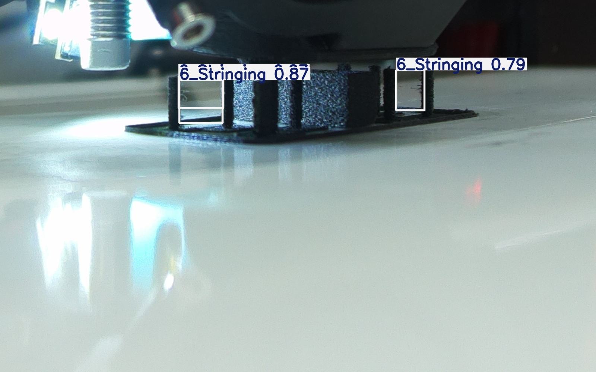
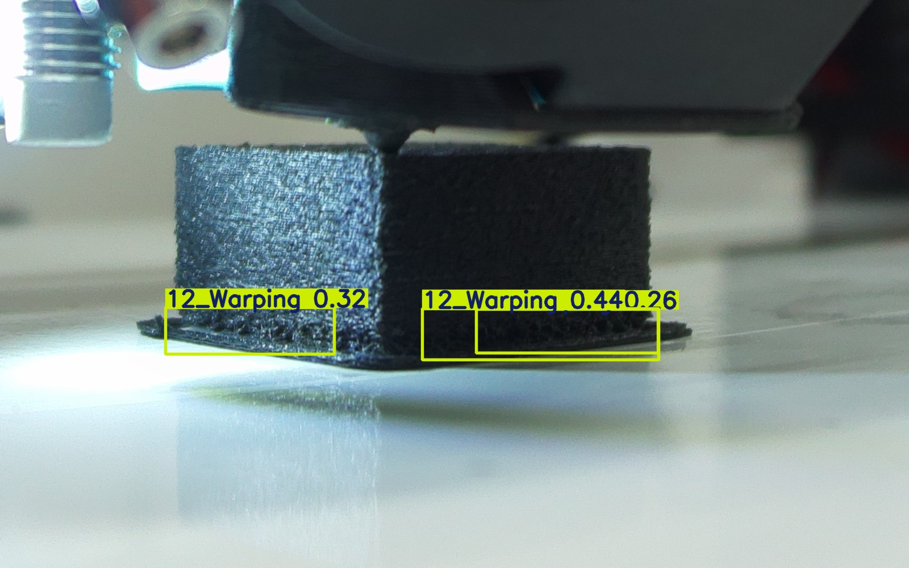

# Real-Time-Defect-Detection-Capstone-Project

YOLOv8-based object detection system for identifying common FFF print defects in real time.

---

## Motivation

Fused Filament Fabrication (FFF) in 3D printing is widely used in rapid prototyping and low-volume manufacturing, yet print failures due to defects can lead to material waste, machine downtime, and increased production costs. Manual monitoring is inefficient and error-prone.

This project aims to develop a real-time computer vision system capable of automatically detecting common FFF print defects during the printing process, enabling early intervention and improved print reliability.

---

## System Overview

The overall pipeline of the project is as follows:

1. Images are collected from FFF printing processes which are already made as datasets
2. Defects are annotated using bounding boxes in YOLO format
3. The dataset is split into training, validation, and test sets
4. YOLOv8 models are trained using transfer learning
5. Hyperparameters are tuned via grid search using validation performance
6. The best model is selected and evaluated on a held-out test set

---
## Features

- Real-time defect detection using **YOLOv8**
- Support for multiple FFF defect classes
- GPU-accelerated training and inference
- Modular **training, validation, and testing** pipeline
- Reproducible **hyperparameter grid search**
- Clear separation between model selection and final testing

---

## Dataset

- Images collected from the project dataset drive
- Annotations in **YOLO format**
- Object detection task with bounding boxes

### Defect Classes

- Spaghetti  
- Poor Bridging  
- Overhang Sag  
- Shifted Layer  
- Warping  
- Delamination  
- Foreign Body  
- Stringing  

---

## Project Structure

```text
data/
  train/
    images/
    labels/
  val/
    images/
    labels/
  test/
    images/
    labels/
  data.yaml
runs/
    detect/
        train_final/
        val/
        test/
        test_metrics/
    gridsearch/
    final_gridsearch
scripts/
    data_splitter.py
    training_loop.ipynb
    Change class.py
README.md
```

---

## Hyperparameter Tuning

A reproducible grid search was conducted to optimize model performance. The following hyperparameters were explored:

- Learning rate:
  - Initial learning rate. Adjusting this value is crucial for the optimization process, influencing how rapidly model weights are updated. 
- Weight decay:
  - L2 regularization term, penalizing large weights to prevent overfitting. 
- Box loss weight:
  - Weight of the box loss component in the loss function, influencing how much emphasis is placed on accurately predicting bounding box coordinates. 
- Classification loss weight:
  - Weight of the classification loss in the total loss function, affecting the importance of correct class prediction relative to other components.
- Number of frozen layers:
  - This grid is for picking the optimum number of frozen layers on the backbone of the model with layer 9 being the last layer of the backbone. This can be visualized in the image below. 

Model selection was based exclusively on validation performance to avoid test set leakage.

---

## Evaluation Metrics

Model performance is evaluated using YOLO-style metrics:

- **mAP@50**
- **mAP@50–95**
- Precision
- Recall
- Per-class Average Precision

All final metrics are reported on a held-out test set that was not used during training or hyperparameter selection.

---

## Environment

The experiments in this project were conducted using the following hardware and software environment.

### Hardware

- GPU: NVIDIA GeForce RTX 4060 Laptop GPU (8 GB VRAM)
- CPU: 12th Gen Intel(R) Core(TM) i7-12650H (2.30 GHz)
- RAM: 32 GB

### Software

- Operating System: Windows 11
- Python: 3.12.x
- PyTorch: 2.5.1 (CUDA-enabled)
- CUDA: 12.1
- Ultralytics YOLOv8: 8.x

### Notes

- GPU acceleration is required for efficient training and inference.
- All experiments were run using the Ultralytics Python API.

---

## Project Workflow

### Part 1 – Preprocessing

- Extract the `dataset.zip` file. It should contain two folders namely: `single_defect_images` and `multiple_defect_images`
- Import the dataset into the `data/` directory  
  - The folder that contains single defect images: `single_defect_images`
  - The folder that contains multiple defect images: `multiple_defect_images`
- Run `data_splitter.py` to generate train, validation, and test splits. The folders would be now called: `train`, `val` and `test` respectfully
- Run the **first six cells** in `main.ipynb` to complete preprocessing. This step would initialize the python environment and crate `data.yaml` configuration file that would be used by the YOLO model.

### Part 2 – Hyperparameter Tuning

- Run the **next three cells** in `main.ipynb` to perform hyperparameter tuning
- There should be two folders created which contain the results of each run that has been done during grid-search namely:
  - `runs/gridsearch_final`
  - `runs/gridsearch_final_new`

### Part 3 – Training and Validation

- Run the **next three cells** in `main.ipynb` to:
  - Set up the training configuration
  - Train the baseline model
  - Evaluate performance on the validation dataset
- The training results should be accessible in:
  - `runs/detect/train_final`
- The predictions on the validation dataset could be found under:
  - `runs/detect/val`

### Part 4 – Testing and Evaluation

- Run the remaining cells in `main.ipynb` to:
  - Evaluate the final model on the test set
  - Generate quantitative metrics and qualitative results
- Final metrics are stored in:
  - `runs/detect/test_metrics`
- Predicted images are stored in:
  - `runs/detect/test`

---

## Example Results

Example detection results, including predicted bounding boxes and defect classes, can be found in `runs/detect/test`:

<p align="center">
  
  
  
  
  
  
</p>

These visualizations demonstrate the model’s ability to localize and classify multiple defect types under varying print conditions.

---

## Limitations and Future Work

### Limitations

- Some images in the dataset are affected by motion blur or focus issues, which reduce defect visibility and negatively impact detection accuracy.
- Variations in camera setups, including camera angle, distance, resolution, and lighting conditions, introduce domain shifts that limit model generalization across different printing environments.

### Future Work

- Expand the dataset to include a broader range of filament colors, materials, and lighting conditions.
- Apply image enhancement or blur-robust training techniques to mitigate the impact of low-quality images.
- Standardize camera placement or apply domain adaptation techniques to improve robustness across different camera setups.
- The model can be deployed to enable real-time defect detection.

---

## Acknowledgments

- Ultralytics YOLOv8 framework
- Project supervisors, dataset contributors and teaching assistants
  - Shantha Kilambi
  - Madalina Fron

This project is made by:
- Lucas Garcia Gomez
- Utku Dinç
- Emre Gungor
- Jan Molenaar
- Mark Pellegrom